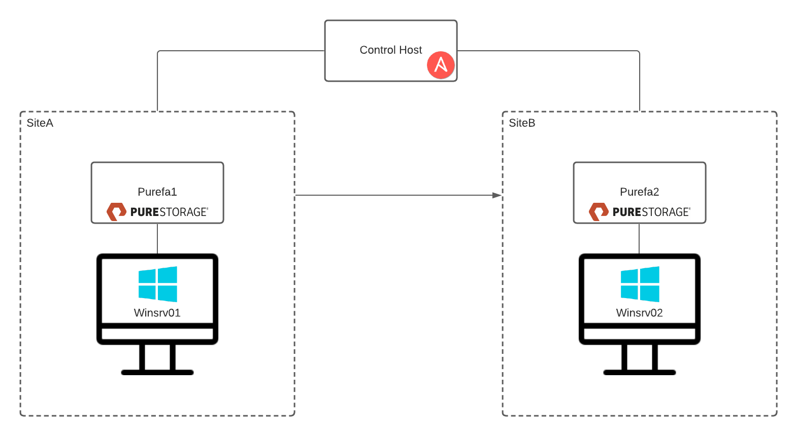

# pure-ansible-livestream
This livestream event is showcasing the development of Ansible playbooks to use in automation of Pure Flash Arrays. In this excercise we build up from using ansible to gather information from the arrays, to building a self-service function to snap, replicate, and restore a volume.

## Environment

The use case involves initating a snapshot in siteA, replicating that snapshot to siteB, restoring that snapshot to a volume on the Pure Flash Array in Site B.

This lab environment is available at [wwt.com](https://wwt.com). There are many ansible on-demand labs on our digital platform including:

- [Pure Ansible Automation](https://www.wwt.com/lab/pure-ansible-automation-lab)
- [Cisco Ansible Automation](https://www.wwt.com/lab/cisco-ansible-automation-training-lab)
- [F5 Ansible Automation](https://www.wwt.com/lab/f5-ansible-automation-training-lab)

## Initial Setup
Install dependencies via pip and Ansible Galaxy.
In the dependencies directory, you will find a requirements.txt file and a requirements.yml file. To install ansible and other python dependencies type:

```bash
pip install -r dependencies/requirements.txt
```

Once Ansible and the other dependencies are installed, we need to install the Ansible collections. Type the following command:

```bash
ansible-galaxy install -r dependencies/requirements.yml
```

The Pure Ansible Demo starts with windows hosts connected to each array via iSCSI. To get to this state, we need to run the setup playbook
```bash
cd Ansible-Setup
ansible-playbook setup-lab.yml
```